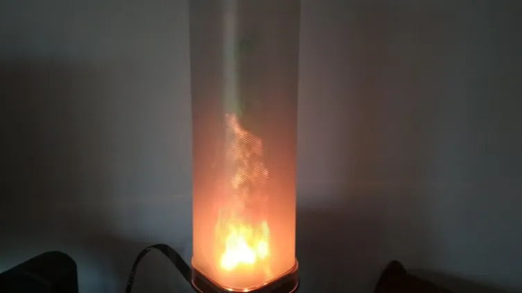

# MusicReactiveLamp

The Music Reactive Lamp is bases on a DFRobot's analog sound sensor and an atmega328, connected to a ws2812 RGB LED strip. Depending on a noise level, the LEDs turn on and off or change colors. If music is quiet, the lamp shines in blue. After volume increases drastically, lamp shines red, and if it is red for too long it smoothly changes to green. Sensitivity of the lamp is adjustable with a potentiometer (in case I want to use it both, in a domesticity and at a party). Everything is set up on my prototype board. A frame of the lamp is made with a jar plastered with a bath mat. The control unit is cased, and can be powered with USB or DC input, up to 12V. Three diodes shows, whether power is plugged, whether the logic part is powered, and whether the atmega works properly.

[Check More on my website]([https://jakubkivi.github.io](https://jakubkivi.github.io/#portfolio-modal-lamp))

[Example Video](https://www.youtube.com/watch?v=IsOpIA3cJoo)
